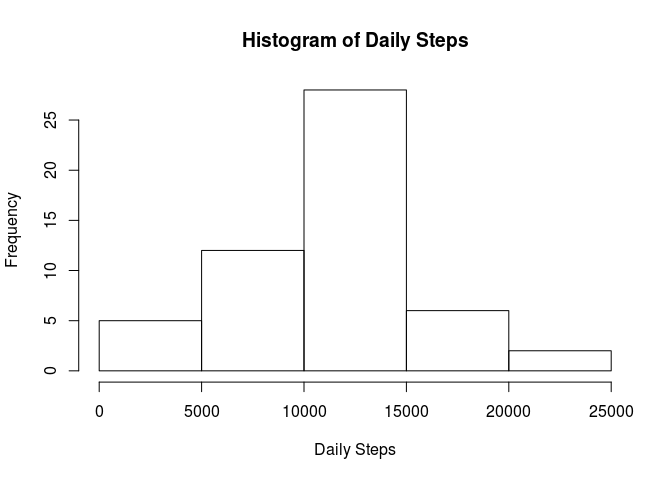

# Reproducible Research: Peer Assessment 1

```r
library(dplyr)
library(lubridate)
library(ggplot2)
library(dplyr)
```
## Loading and preprocessing the data

```r
data <- read.csv(unz("activity.zip", "activity.csv"))
data$date <- ymd(data$date ,tz = "America/New_York") 
```
## What is mean total number of steps taken per day?

```r
stepsPerDay <- data[!is.na(data$steps),] %>% group_by(date) %>% summarise(Sum = sum(steps))
qplot(stepsPerDay$Sum, geom="histogram") 
```



#### The mean is


```r
mean(stepsPerDay$Sum)
```

```
## [1] 10766.19
```
#### The median is 

```r
median(stepsPerDay$Sum)
```

```
## [1] 10765
```

## What is the average daily activity pattern?

```r
stepsPerInterval <- data[!is.na(data$steps),] %>% group_by(interval) %>% summarise(Average = mean(steps))
qplot(interval, Average, data = stepsPerInterval, geom="line") 
```


#### the interval with the maximum steps is 

```r
stepsPerInterval[stepsPerInterval$Average == max(stepsPerInterval$Average), ]
```

```
## Source: local data frame [1 x 2]
## 
##   interval  Average
##      (int)    (dbl)
## 1      835 206.1698
```
## Imputing missing values

```r
length(data[is.na(data$steps),1])
```

```
## [1] 2304
```

```r
dataCleaned <- data
```

#### replacing the NAs with the average for that interval

```r
dataCleaned[is.na(dataCleaned$steps), 1] <- merge(dataCleaned[is.na(dataCleaned$steps), ], stepsPerInterval, by = "interval")$Average
stepsPerDayCleaned <- dataCleaned %>% group_by(date) %>% summarise(Sum = sum(steps))
qplot(stepsPerDayCleaned$Sum, geom="histogram") 
```


#### The mean is


```r
mean(stepsPerDayCleaned$Sum)
```

```
## [1] 10766.19
```

#### The median is 

```r
median(stepsPerDayCleaned$Sum)
```

```
## [1] 11015
```

#### Note the median has shifted to the right as compared to the un-cleaned data, but the mean remained the same

## Are there differences in activity patterns between weekdays and weekends?

```r
dataCleaned$dayType <- as.factor(sapply(dataCleaned$date, function(x) if(wday(x) %in% 1:5) {"weekday"} else {"weekend"}))
stepsPerDayTypeCleaned <- dataCleaned %>% group_by(interval, dayType) %>% summarise(Average = mean(steps))
qplot(interval, Average, data = stepsPerDayTypeCleaned, geom="line", facets = dayType~., ylab = "average number of steps")
```


